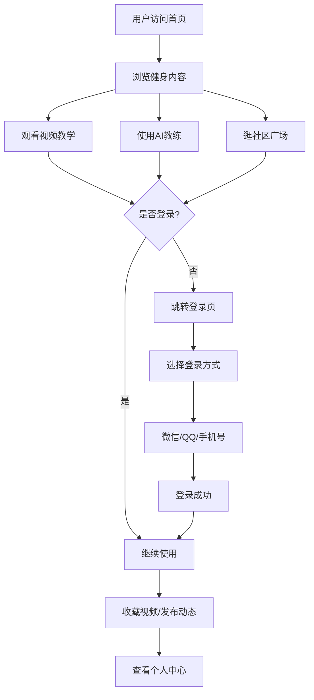

## 1. 产品概述

FitZone 是一个综合性健身平台，为健身爱好者提供专业视频教学、AI智能教练指导和社区交流功能。目标用户涵盖健身新手到进阶爱好者，通过多端登录方式（微信/QQ/手机号）实现无缝健身体验。

## 2. 核心功能

### 2.1 用户角色
| 角色 | 注册方式 | 核心权限 |
|------|----------|----------|
| 普通用户 | 微信/QQ/手机号注册 | 浏览视频、使用AI教练、发布社区动态、评论互动 |

### 2.2 功能模块
1. **首页**：导航栏、Hero区域、健身分类、推荐视频、热门社区
2. **视频教学**：视频分类浏览、视频播放、课程进度、收藏下载
3. **AI教练**：智能对话、健身计划生成、动作指导、饮食建议
4. **社区广场**：动态发布、点赞评论、关注用户、话题标签
5. **用户中心**：登录注册、个人资料、我的收藏、训练记录

### 2.3 页面详情
| 页面名称 | 模块名称 | 功能描述 |
|----------|----------|----------|
| 首页 | 导航栏 | Logo、导航菜单、搜索、登录/个人中心 |
| 首页 | Hero区域 | 大Banner、宣传语、CTA按钮、背景动效 |
| 首页 | 健身分类 | 力量训练、有氧运动、瑜伽、拉伸等分类卡片 |
| 首页 | 推荐视频 | 精选视频推荐、悬停预览效果 |
| 首页 | 社区热帖 | 热门话题、最新动态展示 |
| 视频教学 | 分类筛选 | 按类型/难度/时长筛选视频 |
| 视频教学 | 视频列表 | 视频卡片网格、分页加载 |
| 视频教学 | 视频播放 | 播放器、视频详情、相关推荐、下载功能 |
| AI教练 | 对话界面 | 聊天式交互、消息气泡、打字动效 |
| AI教练 | 快捷功能 | 生成计划、动作咨询、饮食建议快捷入口 |
| 社区广场 | 动态流 | 用户动态瀑布流、图片/文字/视频动态 |
| 社区广场 | 发布功能 | 发布文字、图片、话题标签 |
| 社区广场 | 互动功能 | 点赞、评论、转发、关注 |
| 登录注册 | 登录方式 | 微信登录、QQ登录、手机号登录 |
| 登录注册 | 表单验证 | 验证码、密码强度检测 |
| 用户中心 | 个人资料 | 头像、昵称、简介编辑 |
| 用户中心 | 我的收藏 | 收藏的视频、关注的人 |

## 3. 核心流程

用户访问首页 → 浏览健身内容/视频 → 点击登录（微信/QQ/手机号）→ 使用AI教练定制计划 → 在社区分享心得 → 收藏视频离线观看

## 4. 用户界面设计

### 4.1 设计风格
- **主色调**：活力橙 (#FF6B35) + 深灰黑 (#1A1A2E)，体现健身的力量与活力
- **辅助色**：荧光绿 (#00FF88) 用于强调和互动元素
- **按钮风格**：圆角渐变按钮，悬停有微弹动效
- **字体**：标题使用 Poppins 粗体，正文使用 Inter 常规
- **布局风格**：卡片式布局 + 深色主题 + 玻璃拟态效果
- **图标风格**：线性图标 + 渐变填充，现代感强

### 4.2 页面设计概览
| 页面名称 | 模块名称 | UI元素 |
|----------|----------|--------|
| 首页 | Hero区域 | 全屏背景、渐变遮罩、大标题动画、浮动健身元素 |
| 首页 | 分类卡片 | 3D悬浮效果、渐变背景、图标动画 |
| 视频教学 | 视频卡片 | 悬停放大、播放按钮浮现、时长标签 |
| AI教练 | 对话界面 | 渐变消息气泡、打字指示器、快捷按钮 |
| 社区广场 | 动态卡片 | 瀑布流布局、点赞动画、评论展开 |
| 登录注册 | 登录卡片 | 玻璃拟态、社交登录按钮、渐变边框 |

### 4.3 响应式
- 桌面端优先设计，适配 1200px+
- 平板端 (768px-1199px)：网格自适应收缩
- 移动端 (≤767px)：单列布局、底部导航栏、汉堡菜单

### 4.4 动效设计
- 页面加载：元素渐入 + 位移动画
- 悬停效果：微缩放 + 阴影加深 + 光晕
- 滚动效果：视差滚动 + 元素渐现
- 点击反馈：波纹效果 + 缩放回弹
