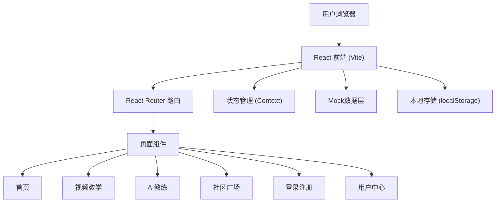

## 1. 架构设计



## 2. 技术选型说明

- **前端框架**：React@18 + Vite@5
- **样式方案**：TailwindCSS@3 + 自定义CSS动画
- **路由管理**：React Router DOM@6
- **状态管理**：React Context + useReducer
- **图标库**：Lucide React
- **视频播放**：原生 HTML5 Video
- **数据模拟**：本地 Mock 数据 + localStorage 持久化
- **AI模拟**：前端模拟智能回复逻辑

## 3. 路由定义

| 路由路径 | 页面名称 | 说明 |
|----------|----------|------|
| / | 首页 | Hero、分类、推荐视频、热门社区 |
| /videos | 视频列表 | 视频分类浏览、筛选 |
| /videos/:id | 视频详情 | 视频播放、详情、相关推荐 |
| /ai-coach | AI教练 | 智能对话、健身指导 |
| /community | 社区广场 | 动态流、发布动态 |
| /login | 登录注册 | 微信/QQ/手机号登录 |
| /profile | 用户中心 | 个人资料、我的收藏 |

## 4. 目录结构

```
src/
├── assets/           # 静态资源
├── components/       # 公共组件
│   ├── Navbar.jsx
│   ├── Footer.jsx
│   ├── VideoCard.jsx
│   ├── PostCard.jsx
│   └── CategoryCard.jsx
├── pages/            # 页面组件
│   ├── Home.jsx
│   ├── Videos.jsx
│   ├── VideoDetail.jsx
│   ├── AICoach.jsx
│   ├── Community.jsx
│   ├── Login.jsx
│   └── Profile.jsx
├── context/          # 状态管理
│   ├── AuthContext.jsx
│   └── AppContext.jsx
├── data/             # Mock数据
│   ├── videos.js
│   ├── posts.js
│   └── categories.js
├── hooks/            # 自定义Hooks
├── utils/            # 工具函数
├── App.jsx
├── main.jsx
└── index.css
```

## 5. 核心数据模型

### 5.1 用户模型
```javascript
{
  id: string,
  nickname: string,
  avatar: string,
  phone: string,
  loginType: 'wechat' | 'qq' | 'phone',
  bio: string,
  followers: number,
  following: number,
  createdAt: date
}
```

### 5.2 视频模型
```javascript
{
  id: string,
  title: string,
  description: string,
  thumbnail: string,
  videoUrl: string,
  duration: string,
  category: string,
  difficulty: 'beginner' | 'intermediate' | 'advanced',
  views: number,
  likes: number,
  author: string,
  tags: string[]
}
```

### 5.3 社区动态模型
```javascript
{
  id: string,
  userId: string,
  userName: string,
  userAvatar: string,
  content: string,
  images: string[],
  likes: number,
  comments: number,
  shares: number,
  tags: string[],
  createdAt: date,
  isLiked: boolean
}
```

### 5.4 AI对话模型
```javascript
{
  id: string,
  role: 'user' | 'assistant',
  content: string,
  timestamp: date
}
```

## 6. 视频资源方案

由于无法直接下载版权视频，采用以下方案：
- 使用公开可访问的示例视频URL进行演示
- 视频分类涵盖：力量训练、有氧运动、瑜伽、拉伸、HIIT、普拉提等
- 每个分类提供多个视频示例
- 实现下载按钮UI（前端模拟下载功能）

## 7. 功能实现说明

### 7.1 登录功能
- 微信/QQ/手机号三种登录方式UI
- 前端模拟登录流程，使用localStorage存储用户状态
- 手机号登录支持验证码发送（模拟）

### 7.2 AI教练
- 预设健身知识问答库
- 模拟AI对话回复，支持常见健身问题
- 支持生成健身计划模板
- 打字机效果展示AI回复

### 7.3 社区广场
- 瀑布流布局展示动态
- 支持发布文字+图片动态
- 点赞、评论、转发交互
- 话题标签功能

### 7.4 视频教学
- 视频分类筛选
- 视频播放（HTML5 Video）
- 收藏功能（本地存储）
- 下载功能UI
